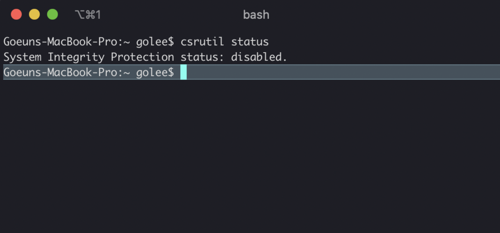

### 🔑 Keyword

- #####[MongoDB](<[https://ko.wikipedia.org/wiki/%EB%AA%BD%EA%B3%A0DB](https://ko.wikipedia.org/wiki/몽고DB)>) : 다큐먼트 지향 데이터 베이스 시스템 | 많은 업체 웹사이트 및 서비스가 이를 백엔드 소프트웨어로 사용 중

- #####[macOS](https://ko.wikipedia.org/wiki/MacOS) : 애플이 제작한 매킨토시 운영 체제

- #####[Catalina](https://ko.wikipedia.org/wiki/MacOS_카탈리나) : 애플의 16번째 MacOS 시리즈 (\* 이전 버전은 Mojave)

- #####[Root Folder](<[https://ko.wikipedia.org/wiki/%EB%A3%A8%ED%8A%B8_%EB%94%94%EB%A0%89%ED%86%A0%EB%A6%AC](https://ko.wikipedia.org/wiki/루트_디렉토리)>) : 혹은 루트 디렉토리라고도 불리며, 모든 디렉토리의 시작점인 최상위 디렉토리

<br>
<hr>

### ❌ Problem

<br>

​ macOS가 Catalina로 업데이트 되면서 자잘한 (~~이라고 쓰고 귀찮은이라고 읽는~~) 에러가 발생하고 있다 😤🤯 최악의 경우는 단연 DB 클래스 수강을 하면서 MongoDB를 설치할 때라고 할 수 있다. Root folder의 `data/db`에 MongoDB 설치 에러가 발생했기 때문인데, 아마도 macOS모하비 기준 (2019/10 이전)으로 제작된 클래스라서 이런 오류를 해결하는데 더욱 오랜 시간이 걸린 것 같다.

​ MongoDB는 root folder에 위치한 `data/db`에 바로 데이터 베이스 정보를 저장하기 때문에, 이를 위해 `data/db`에 접근했지만 Catalina는 Read-only만 허용하기 때문에 이러한 에러가 발생했다.

​ 이를 해결하기 위해 `data/db` 장소 옮기며, 아래와 같이 직접 `data/db`의 path를 입력하는 방법으로 문제를 해결했다.
<br>
<br>

<hr>

### ✅ How to Solve

#####1) 시스템 무결성 보호 (SIP) 상태 해제하기

- 먼저 상태 확인을 위해 터미널을 키고 `csrutil status` 를 실행



###### \* 사진과 같이 disabled 상태라면 계속해서 진행

- enabled 상태라면

  1. 맥을 restart(재시동) 한다

  2. 재시동 중에 `CMD + R`을 눌러 리커버리 모드에 진입힌다.

  3. Utilities 탭을 눌러 터미널을 켜고 `csrutil disable`을 입력해 SIP를 해제한다.

#####2) `/data/db` 이동하기

- 터미널에 `sudo mount -uw /`을 입력하여 `/System/Volumes/Data/`로 옮긴다.

#####3) MongoDB 설치하기

- MongoDB Community 버젼을 설치한다 ([참조 링크](https://docs.mongodb.com/manual/administration/install-community/))

  ```
  brew tap mongodb/brew

  brew install mongodb-community

  brew services start mongodb-community
  ```

#####4) MongoDB 실행하기

- MongoDB를 실행하기 위해 터미널을 켜고

  ```
  sudo mongod --dbpath /System/Volumes/Data/data/db
  ```

을 입력한다.

<br>
<hr>

###**TIP**) 터미널 alias 설정하기
<br>
​ 매번 MongoDB 실행할 때 마다 `--dbpath`를 입력하기가 너무 귀찮아서 구글링을 하던 중에, 참고 자료를 발견 하였다. 미리 알았다면 더 좋았을 텐데... 🤯 이런 귀찮음을 방지하기 위해 터미널 alias로 명령어를 설정할 수 있다.

alias 문법은 `alias <newcommand> = '<old command>'`이기 때문에,

```

alias mongod="sudo mongod --dbpath /System/Volumes/Data/data/db"

```

이렇게 설정을 해두면 차후 `--dbpath`를 하기 위해 구글링을 반복하지 않아도 된다.
<br>
<br>
👉🏻 참조 : [Installing MongoDB on **macOS Catalina**](https://medium.com/better-programming/installing-mongodb-on-macos-catalina-aab1cbe0c836)

<br>
