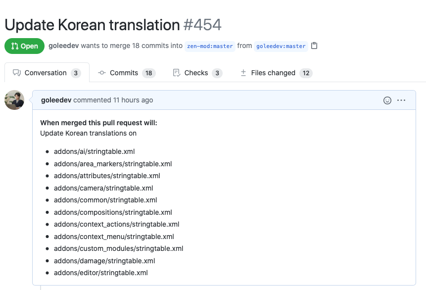

 

### 🤦 TL; DR
 

- **주니어 개발자 / 오픈 소스 쫄**보가 Contributor가 되는 첫 스텝

- 오픈 소스 프로젝트에 **PR 보내기**

 

---

# ☝️ Open Source Noob에서 Contributor 까지

 

###📍 Open Source 란?
 

​	오픈소스란 원래 오픈소스 소프트웨어(Open Source Software, OSS)를 뜻하는 용어입니다. 오픈소스 소프트웨어는 공개적으로 액세스할 수 있게 설계되어 누구나 자유롭게 확인, 수정, 배포할 수 있는 코드입니다. 오픈소스 소프트웨어는 동료 평가(peer review) 와 커뮤니티 기반 프로덕션에 의지하므로, 분산된 동시에 협업 방식으로 개발됩니다. 단일 작성자 또는 기업이 아닌 커뮤니티가 개발하므로 독점적 소프트웨어보다 저렴하고, 유연하며, 지속성이 있습니다. (Written by Red Hat)

 

###📍 첫 Open Source 프로젝트 고르기
 

#### Language로 검색하기
 
- 본인이 가장 많이 사용하는 language 라이브러리 등의 레포지토리를 검색하여 **오픈된 이슈**를 확인해본다. 

- 참여하고 싶은 이슈를 발견하면 코멘트를 남기거나, 바로 PR(related to the issue)을 보내서 본인의 참여의사를 밝힌다.

  (Contribute하고 싶은 사람이 많다보니 이슈가 빠르게 taken되는 편)

 

#### ...or Label로 검색하기
 

* Github search에서 **label: {원하는 레이블}** 형태로 검색해서 **Newest 필터**를 걸면 최신 이슈/pr을 확인할 수 있다.

* 하지만, 아직 PR 보낸 적이 없어서 연습을 하고 싶다거나, 코드 관련 이슈에 참여하기 힘들다면 **label: translation**으로 시작하는 것이 좋다. 

 

  

  (사진 참조 | Under Review 상태)

 

###📍 Contribute 하기 (for translators)
 

1. 프로젝트 **Fork 하기**
2. 번역이 필요한 파일에 **가이드라인에 맞는 번역본**을 추가하기
3. 번역 완료 후 **PR 보내기**
4. (피드백이 있다면) **피드백 관련 이슈 수정하기**
5. 프로젝트 멤버가 **Review + Merge 기다리기**

 

---

### 🔗 Reference
 

- [**Red Hat**](https://www.redhat.com/ko/topics/open-source/what-is-open-source) | **오픈소스란?**

